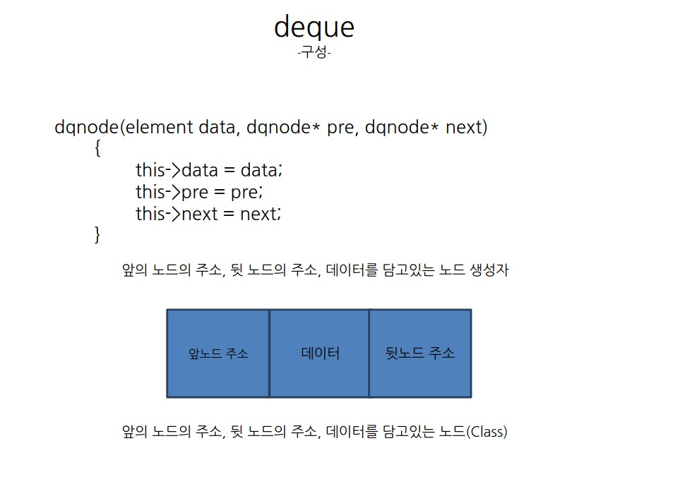
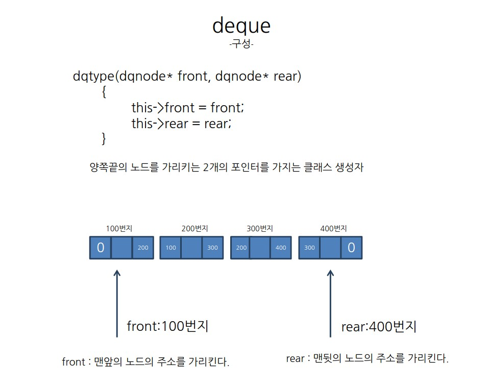
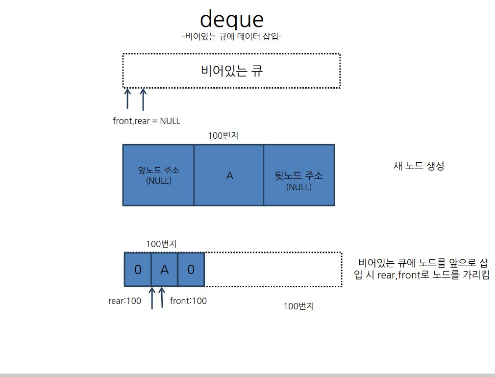
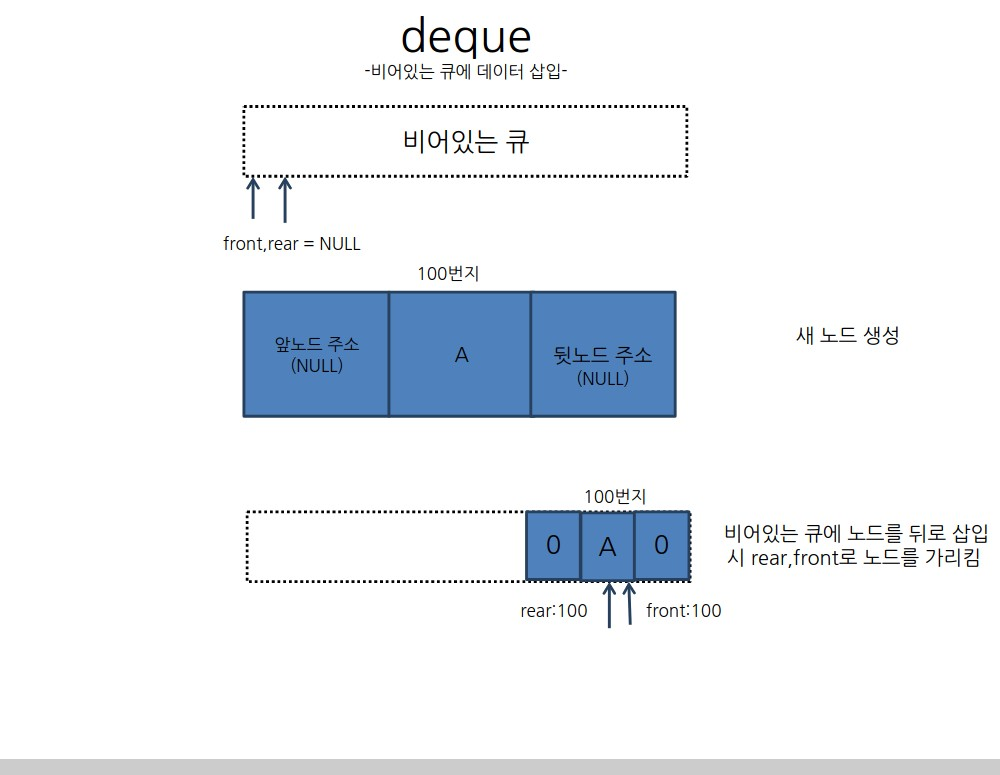
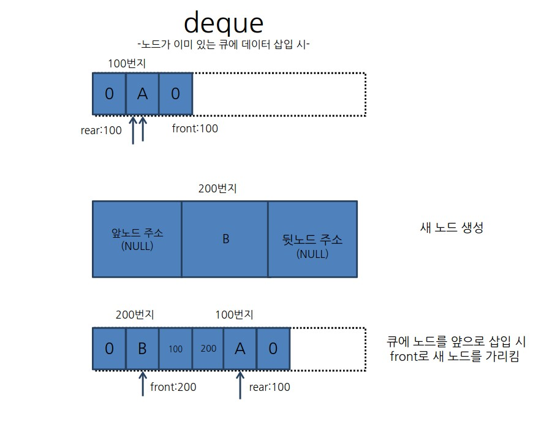

# deque 
- 데이터를 저장하거나 삭제할 때 맨 앞 또는 맨 뒤쪽부터 수정하는 자료구조방식

## 비어있는 큐에 데이터를 앞에서 삽입 시
> void insertfront(dqtype* dq,element data) 
>{ 
>	dqnode* newnode = new dqnode(data,NULL,NULL);  
>	if(isempty(dq)) 
>{ 
>		dq->front = newnode; 
>		dq->rear = newnode; 
>	} 

Cancel changes
## 비어있는 큐에 데이터를 뒤에서 삽입 시
> void insertrear(dqtype* dq,element data) 
>{ 
>	dqnode* newnode = new dqnode(data,NULL,NULL);  
>	if(isempty(dq)) 
>{ 
>		dq->front = newnode; 
>		dq->rear = newnode; 
>	} 

## 이미 노드가 있는 큐에 앞에 새 노드를 삽입 시
>void insertfront(dqtype* dq,element data)  
>{ 
>	dqnode* newnode = new dqnode(data,NULL,NULL); 
>	if(isempty(dq)) 
>	{ 
>		dq->front = newnode; 
>		dq->rear = newnode; 
>	} 
>	else 
>	{	 
>		newnode->next=dq->front; 
>		newnode->pre = NULL; 
>		dq->front->pre=newnode; 
>		dq->front=newnode; 
> 
>	} 
>} 

 ### newnode->next=dq->front 
 - 새 노드가 맨 앞으로 오게되므로 새 노드의 next에 기존애 가장 앞에있었던 노드의 주소를 저장한다.
 ### newnode->pre=NULL
 - 마찬가지로 새 노드 앞에는 아무 노드가 없으므로 pre에는 NULL를 저장한다.
 ### dq->front->pre = newnode
 - 기존에 맨 앞이 었던 노드앞에 새 노드가 생겼으므로 dq->front->pre(기존에 있던 노드의 pre)에 새 노드의 주소를 넣는다. 
 ### dq->front = newnode
 - front 포인터는 늘 젤 앞의 노드를 가르켜야 하므로 새 노드의 주소를 가리킨다.
 

