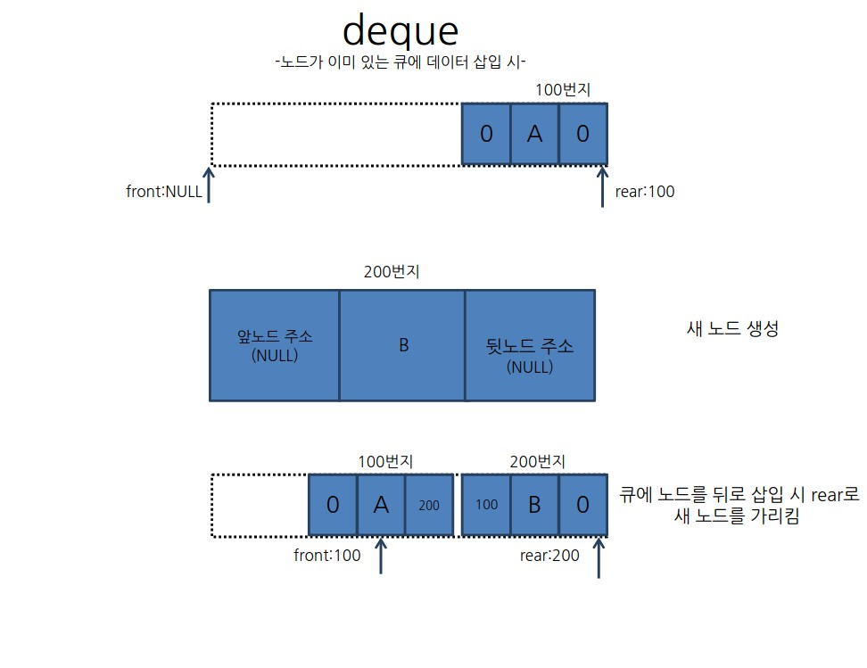

# deque 
- 데이터를 저장하거나 삭제할 때 맨 앞 또는 맨 뒤쪽부터 수정하는 자료구조방식

## 비어있는 큐에 데이터를 앞에서 삽입 시
> void insertfront(dqtype* dq,element data) 
>{ 
>	dqnode* newnode = new dqnode(data,NULL,NULL);  
>	if(isempty(dq)) 
>{ 
>		dq->front = newnode; 
>		dq->rear = newnode; 
>	} 

Cancel changes
## 비어있는 큐에 데이터를 뒤에서 삽입 시
> void insertrear(dqtype* dq,element data) 
>{ 
>	dqnode* newnode = new dqnode(data,NULL,NULL);  
>	if(isempty(dq)) 
>{ 
>		dq->front = newnode; 
>		dq->rear = newnode; 
>	} 

## 이미 노드가 있는 큐에 앞에 새 노드를 삽입 시
>void insertfront(dqtype* dq,element data)  
>{ 
>	dqnode* newnode = new dqnode(data,NULL,NULL); 
>	if(isempty(dq)) 
>	{ 
>		dq->front = newnode; 
>		dq->rear = newnode; 
>	} 
>	else 
>	{	 
>		newnode->next=dq->front; 
>		newnode->pre = NULL; 
>		dq->front->pre=newnode; 
>		dq->front=newnode; 
> 
>	} 
>} 

 ### newnode->next=dq->front 
 - 새 노드가 맨 앞으로 오게되므로 새 노드의 next에 기존애 가장 앞에있었던 노드의 주소를 저장한다.
 ### newnode->pre=NULL
 - 마찬가지로 새 노드 앞에는 아무 노드가 없으므로 pre에는 NULL를 저장한다.
 ### dq->front->pre = newnode
 - 기존에 맨 앞이 었던 노드앞에 새 노드가 생겼으므로 dq->front->pre(기존에 있던 노드의 pre)에 새 노드의 주소를 넣는다. 
 ### dq->front = newnode
 - front 포인터는 늘 젤 앞의 노드를 가르켜야 하므로 새 노드의 주소를 가리킨다.
 

## 이미 노드가 있는 큐에 뒤에서 새 노드를 삽입 시
>void insertrear(dqtype* dq,element data) 
>{	dqnode* newnode = new dqnode(data,NULL,NULL); 
>	if(isempty(dq)) 
>	{ 
>		dq->front = newnode; 
>		dq->rear = newnode; 
>	} 
>	else 
>	{ 
>		newnode->pre = dq->rear; 
>		newnode->next = NULL; 
> 	dq->rear->next = newnode; 
> 	dq->rear = newnode; 
>} 
>} 

 ### newnode->pre=dq->rear 
 - 새 노드가 맨 뒤로 오게되므로 새 노드의 pre에 기존애 가장 뒤에있었던 노드의 주소를 저장한다.
 ### newnode->next=NULL
 - 마찬가지로 새 노드 뒤에는 아무 노드가 없으므로 next에는 NULL를 저장한다.
 ### dq->rear->next = newnode
 - 기존에 맨 뒤에 었던 노드앞에 새 노드가 생겼으므로 dq->front->next(기존에 있던 노드의 next)에 새 노드의 주소를 넣는다. 
 ### dq->rear = newnode
 - rear 포인터는 늘 젤 뒤의 노드를 가르켜야 하므로 새 노드의 주소를 가리킨다.
 

## 큐에 있는 맨앞 데이터를 제거 시  
> element deletefront(dqtype* dq) 
>{	 
>	element item; 
>	if(isempty(dq)) 
>	{ 
>		return 0; 
>	} 
>	else { 
>	dqnode* old = dq->front; 
>	item=old->data; 
>	if(dq->front->next==NULL) 
>	{ 
>	dq->front = NULL; 
>	dq->rear = NULL; 
>	} 
>	else
>	{ 
>	dq->front = dq->front->next; 
>	dq->front->pre=NULL; 
>	delete old; 
>	} 
>	} 
>	return item; 
>} 

### if(isempty(dq)) 
- 큐에 데이터가 없을 시 제거연산을 수행하지 않음
### if(dq->front->next==NULL)
### dq->front = NULL; 
### dq->front = NULL; 
- dq->front->next==NULL은 맨 앞의 데이터의 오른쪽에 아무 노드가 없을때 라는 뜻이다 
> 즉 큐에 노드가 하나있는것을 제거 할때 front와 rear를 NULL로 저장.
### dqnode* old = dq->front
- old:노드를 가리키는 포인터 
- Old에 현재 맨앞의 노드의 주소를 저장
### dq->front = dq->front->next
- front포인터가 제거해야할 노드의 오른쪽 노드주소를 가리키도록 함.
### dq->front->pre=NULL
- 그리고 제거해야할 노드가 지워지면 front가 가리키는 노드가 맨 앞이 되므로 pre를 NULL로 저장
### delete old; 
- 제거해야할 노드를 제거 

## 큐에 있는 맨 뒤 데이터를 제거 시  
>element deleterear(dqtype* dq) 
{	element item; 
	dqnode* old = dq->rear; 
	if(isempty(dq)) 
	{ 
		return 0; 
	} 
	 
	else 
	{	 
		 
		item = old->data; 
		if(dq->rear->pre == NULL) 
		{ 
			dq->front=NULL; 
			dq->rear=NULL; 
		} 
		else 
		{ 
			dq->rear = dq->rear->pre; 
			dq->rear->next=NULL; 
		} 
	 
>	} 
